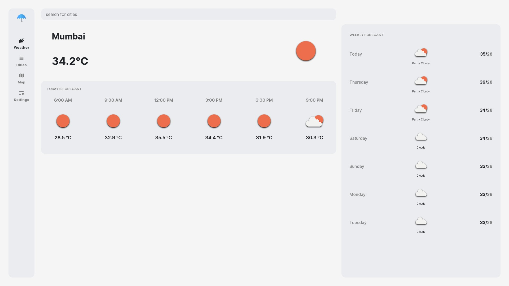

# Weather app

### For live demo [click here](https://freeweather.vercel.app)

## Description

A weather web application built with Next.js allows user to serach weather of any country with 7 days forecast.

## Installation

1. Clone the repository: `git clone https://github.com/itsajaygaur/weather.git`
2. Navigate to the project directory: `cd your-repo`
3. Install dependencies: `npm install`
4. Start the development server: `npm run dev`

## Usage

1. Start the development server using the instructions above.
2. Open your browser and navigate to `http://localhost:3000` (or the specified port).
3. Search for any city to get it's weather and 7 days forecast.

